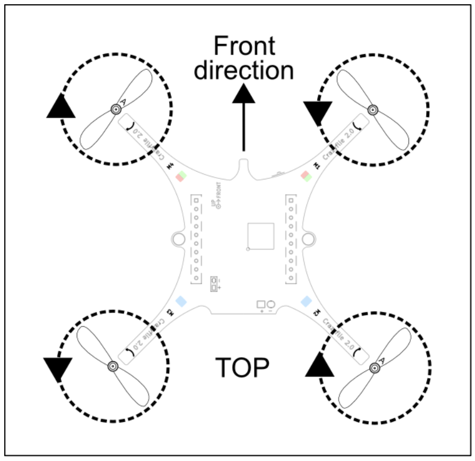
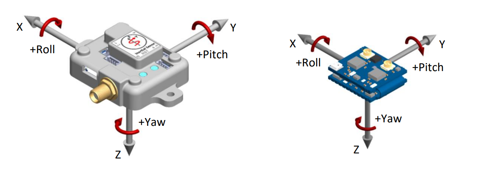

- params.py: contains physical parameters of the drone and other helpful constants
- mixer.py: motor mixing algorithm, nonlinear map from commanded wrench -> motor PWMs
- dynamics.py: contains full continuous nonlinear dynamics of the drone, and hover linearization
- lqr_control.py: derivation of feedback gains using LQR with integral action
- sim.py: runs the simulation via RK45 solver, post-processing for plots/animation.
- waypoint_following.py: example of different guidance laws for dubin bank-to-turn aircraft (NLGL, Vector Field, PLOS, carrot-chasing)

Drone motor ordering and directions:

NED coordinate system example:

